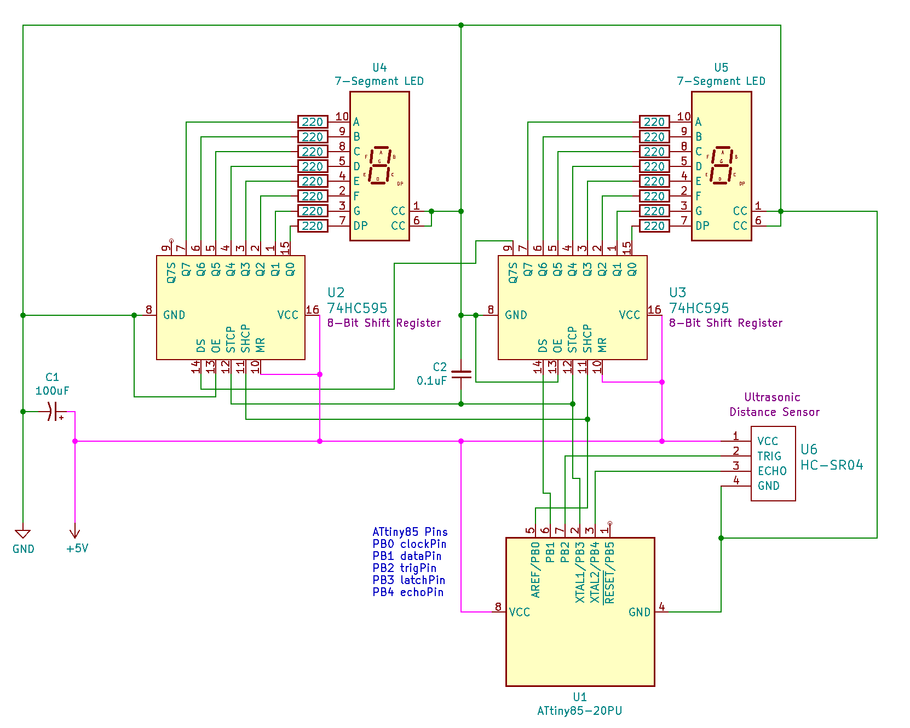

# UltrasonicDistanceDisplay
ATtiny85 Ultrasound Distance Measurement with Dual Segment LED Display

## Description
This project uses the HC-SR04 ultrasonic distance module to determine distance and display the results via two 7-segment LED displays. The HC-SR04 provides readings from 2cm to 400cm (1in to 13ft).

### Imperial and SI Units
In Imperial unit mode, the code is written to display distances in inches (1 to 11) for distances less than 1 foot.  Once the distance reaches 1 foot, it will show feet in decimal (1.0 to 9.9) until the distance reaches 10 feet when it will display in feet only (e.g. 10). 

In SI unit mode, it will show centimeters for distances less than 1 meter, then it will show meters with decimal until the distance reaches 10 meters and will continue to show meters only.

To toggle Units:  Hold the distance to 4 (either unit) for ~4 seconds and it will toggle between units.  Imperial mode will flash "in" and SI mode will flash "c".

Components:
* ATiny85 Microcontroller
* HC-SR04 Ultrasonic Distance Sensor
* 74HC595 8-bit Shift Register (Qty 2)
* 7-Segement LED Display (Qty 2)
* 0.1uF Ceramic Capacitor
* 100uF Electrolytic Capacitor
* 5V Power Supply

## Circuit
Note: Currently the circuit prototype is being tested.

### Schematic

## List of Materials
#### Integrated Circuits
* 1 x ATiny85 Microcontroller
* 2 x 74HC595 8-bit Shift Register
#### Sensors
* 1 x HC-SR04 Ultrasonic Distance Sensor
#### Display/LED
* 2 x 7-Segement LED Display
#### Power Supply
* 5V Power Supply
#### Misc
* 16 x 220 Ohm Resistor
* 1 x 100uF Electrolytic Capacitor [DigiKey](https://www.digikey.com/product-detail/en/panasonic-electronic-components/ECA-1CM101I/P10408TB-ND/268493)
* 1 x 0.1uF Ceramic Capactior - [Amazon](https://www.amazon.com/Almencla-100Pcs-Ceramic-Capacitor-Electronic/dp/B07LD9T497)

## References
* Hackster, Tauno Erik, Selfmade I2C 7-Segment Display with ATtiny85 - https://www.hackster.io/taunoerik/selfmade-i2c-7-segment-display-with-attiny85-a637d0

* Instructables ATtiny85 HC-SR04 Pocket-Sized Ultrasonic Ruler - 
https://www.instructables.com/id/Pocket-Sized-Ultrasonic-Ruler/

